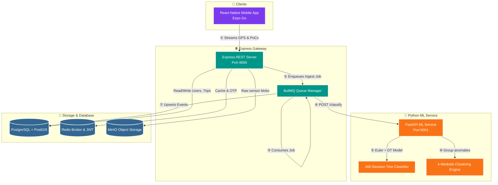

<div align="center">

# 🛣️ RoadSense AI

### *Your Phone. Every Pothole. One Map.*

**A crowdsourced road intelligence platform that turns every smartphone into a passive road-quality sensor — detecting potholes, speed-breakers, and broken patches in real time, regardless of vehicle, device, or driver.**

<br/>

[](https://opensource.org/licenses/MIT)
[]()
[](#)
[]()

<br/>


<br/>

[**🎯 Features**](#-core-capabilities) ·
[**🏗️ Architecture**](#%EF%B8%8F-system-architecture) ·
[**🧮 The Science**](#-algorithmic--ml-core) ·
[**🚀 Quick Start**](#-getting-started) ·
[**📡 API**](#-api-cheat-sheet) ·
[**📚 Docs**](#-documentation-index)

</div>

---

<div align="center">

### 📜 *Built on peer-reviewed research*

> *"Crowdsourcing from the True Crowd: Device, Vehicle, Road-Surface and Driving Independent Road Profiling from Smartphone Sensors"*
> — **Alam et al.**, *Pervasive and Mobile Computing (2020)*

</div>

---

## 💡 Why RoadSense?

Bad roads cost lives, fuel, vehicles, and time — and yet, the maps that guide us still pretend every street is smooth. RoadSense flips that paradigm. It runs **silently** in the background of everyday commutes, listening to your phone's accelerometer like a doctor listens to a heartbeat, and stitches millions of micro-detections into a **living, geo-tagged map of road health**.

| 🚗 **For Commuters** | 🚚 **For Fleets** | 🏛️ **For Cities** |
| :---: | :---: | :---: |
| Get warned *before* you hit the pothole | Reduce vehicle wear & insurance claims | Prioritize repairs with data, not complaints |
| Plan smoother routes | Optimize delivery scheduling | Quantify infrastructure quality block-by-block |
| Earn leaderboard rank for your contributions | Audit road conditions on supply lanes | Verify contractor work with crowd evidence |

---

## 📖 Table of Contents

<details>
<summary><b>Click to expand</b></summary>

1. [✨ Core Capabilities](#-core-capabilities)
2. [🏗️ System Architecture](#%EF%B8%8F-system-architecture)
3. [🧮 Algorithmic & ML Core](#-algorithmic--ml-core)
4. [🛠️ Tech Stack](#%EF%B8%8F-tech-stack)
5. [🤖 Agent Skills & Automation](#-agent-skills--automation)
6. [📁 Repository Structure](#-repository-structure)
7. [🚀 Getting Started](#-getting-started)
8. [📡 API Cheat Sheet](#-api-cheat-sheet)
9. [📚 Documentation Index](#-documentation-index)
10. [👤 Author](#-author)

</details>

---

## ✨ Core Capabilities

<table>
<tr>
<td width="50%" valign="top">

### 📱 Passive Background Sensing
Runs **silently** during commutes using only the standard accelerometer and gyroscope. No screen time, no manual tagging — just commute and contribute.

### 📐 Auto-Orientation Engine
Normalizes three-axis sensor data into a standard vehicle reference frame using **real-time Euler rotation**, so the system doesn't care whether your phone is in your pocket, on the dashboard, or strapped to a handlebar.

### ⚡ Speed-Adaptive Thresholds
Static thresholds fail at highway speeds. RoadSense **dynamically scales** detection thresholds with vehicle speed, eliminating false positives in stop-and-go and false negatives on open roads.

### 🤖 ML Classification (J48 Decision Tree)
A trained classifier ingests a **5-dimensional context vector** (`Zₜ`, `Z_prev`, `Z_next`, time-delta, speed) to filter out noise and tag each event as a **pothole**, **speed-breaker**, or **broken patch**.

</td>
<td width="50%" valign="top">

### 📍 k-Medoids Spatial Clustering
Geo-localizes events by clustering detections **across distinct trips**. A pothole is only "real" once `⌈N_T/3⌉ + 1` independent riders agree on the spot — eliminating phantom detections.

### 🔊 Real-Time Proximity & Sound Alerts
Instant **haptic pulses**, full-screen warning overlays, and **audible notification beeps** (via `expo-av`) alert active drivers to oncoming anomalies. Features a sound toggle directly on the active ride screen.

### 📊 Optimized Live Telemetry Feed
Real-time visual feed of oriented accelerometer forces ($X, Y, Z$ in g) throttled to 4Hz (previously 15Hz) to keep it smooth and decouple high-frequency updates from heavy map re-renders.

### 🗂️ Interactive Confirmations Queue
A floating glassmorphic overlay card that pops up with haptic feedback when an anomaly is detected. Let's users confirm the event, switch its type, or dismiss it. Features an 8-second auto-dismiss progress bar and pending counter to handle consecutive speed-breakers cleanly without distraction.

### 📄 Trip Report Exports (CSV, Excel, PDF)
Generates detailed post-trip reports locally on the device immediately after ending a trip. Users can export ride metadata and mapped road anomalies in three formats: standard CSV, MS Excel-compatible tab-separated format (`.xls`), and a beautifully styled PDF report (rendered from custom HTML) with full support for sharing via the native share sheet.

### 🏆 Gamification & Leaderboard
Top contributors are ranked by **trip coverage**, **events confirmed**, and **distance traveled** — turning civic data collection into a friendly competition.

### 🗺️ Road Quality Index (RQI)
Every neighborhood gets a **0–100 quality score** computed from event density, severity, and confidence — perfect for civic dashboards.

</td>
</tr>
</table>

---

## 🏗️ System Architecture

RoadSense AI runs on a **dual-service architecture**: a Node.js/Express gateway handles user auth, CRUD, and telemetry ingestion, while a Python microservice handles heavy-lifting ML inference and spatial clustering. BullMQ keeps them decoupled and queueable.



> **Why two services?** Node.js excels at I/O-bound work (auth, REST, WebSockets). Python dominates at vectorized math and ML inference. Why not have both?

---

## 🧮 Algorithmic & ML Core

> *RoadSense implements the algorithms laid out in the **RoadSurP** paper — verbatim and verifiable.*

### ① Auto-Orientation Formula

Raw accelerometer data (`aₓ`, `a_y`, `a_z`) is rotated from the **device's** variable reference frame into the **vehicle's** stable frame using continuously-computed Euler pitch (θ) and roll (β):

$$\theta = \arctan2(a_y, a_z)$$

$$\beta = \arctan2(-a_x, \sqrt{a_y^2 + a_z^2})$$

The vertical (Z-axis) component — the one that actually captures road displacement — is isolated as:

$$a_{z_v} = -a_x \sin(\beta) + a_y \cos(\beta) \sin(\theta) + a_z \cos(\beta) \cos(\theta)$$

### ② Speed-Adaptive Thresholds

Static thresholds break above 40 km/h. RoadSense scales the vertical-acceleration trigger ($T_t$) with average vehicle speed ($V$):

$$T_t = \begin{cases} T_0 + (V - L) \cdot S & \text{if } V > B \\ T_0 & \text{otherwise} \end{cases}$$

Pothole dynamic thresholds correctly decrease with speed (using negative $S$) to stay sensitive at higher velocities, clamped to a minimum of `0.15g`. Speed-breaker thresholds increase with speed (using positive $S$), clamped between `0.5g` and `4.0g` to prevent unphysical values.

Detections are gated by acceleration direction:
- **Upward spikes** (`z_filtered > 0`) are validated against the speed-breaker threshold.
- **Downward spikes** (`z_filtered < 0`) are validated against the pothole threshold.

<div align="center">

| Symbol | Meaning | Typical Value |
| :---: | :--- | :---: |
| `T₀` | Base threshold | `1.08g` (4-wheel speed-breaker) · `0.714g` (2-wheel pothole) |
| `B` | Activation speed | `20.0 km/h` |
| `L` | Lower adaptation limit | `20.0 km/h` |
| `S` | Scaling factor | `+0.3` (breakers) · `−0.3` (potholes) |

</div>

### ③ ML Feature Vector → J48 Classifier

Once a Point-of-Concern (PoC) clears the dynamic threshold, a **5-dimensional feature vector** is sent to the classifier:

$$\vec{x} = \begin{bmatrix} Z_t & Z_{\text{next}} & Z_{\text{prev}} & T_p & S_p \end{bmatrix}$$

| Feature | What It Captures |
| :---: | :--- |
| **Zₜ** | Peak vertical acceleration at detection |
| **Z_next** | Captured immediately on the sample following the peak — reveals event shape |
| **Z_prev** | Vertical acceleration of the sample preceding the peak |
| **Tₚ** | Time since the last event — dense bursts ⇒ *broken patch* |
| **Sₚ** | GPS-reported vehicle speed at the moment |

### ④ k-Medoids Spatial Clustering

Detections are clustered around the **median** event coordinate (not the mean — medoids resist GPS noise). An event is only promoted to a **`ConfirmedEvent`** once:

$$N_{\text{agreeing trips}} \geq \lceil N_T / 3 \rceil + 1$$

This makes the system **provably resistant** to bad sensors, rogue users, and one-off road debris.

---

## 🛠️ Tech Stack

<div align="center">

| Layer | Tech |
| :--- | :--- |
| 📱 **Mobile Client** | Expo SDK 53 · React Native · TypeScript · Zustand · TanStack Query |
| 📡 **Mobile Hardware** | `expo-sensors` (150Hz accel/gyro) · `expo-location` (GPS) |
| 🎨 **UI & Animations** | `react-native-reanimated` · `expo-blur` (glassmorphism) · `expo-linear-gradient` |
| 🌐 **API Gateway** | Node.js · Express · TypeScript · JWT · `ioredis` |
| 🗄️ **Database** | PostgreSQL 16 · PostGIS · Prisma ORM |
| 🔄 **Queue Worker** | BullMQ + Redis |
| 🧠 **ML Service** | Python 3.11 · FastAPI · scikit-learn · NumPy · Pandas · Uvicorn |
| 📦 **Object Store** | MinIO S3 (raw vibration blobs) |

</div>

---

## 🤖 Agent Skills & Automation

This repo ships **built-in automation for AI coding agents** through **Matt Pocock's Skills** framework — so any LLM that opens this project understands the architecture, design system, and conventions out of the box.

- 🧠 **`.agents/skills/`** — Active workflows and system prompts
  - `setup-matt-pocock-skills` — Bootstraps domain rules, triage labels, issue sync
  - `design-system` — Enforces the premium glassmorphic UI/UX standards for the mobile app
- ⚙️ **`.openclaude/`** — Localized AI configuration for persistent coding-session context

---

## 📁 Repository Structure

```
RoadSense-AI/
├── 📡 backend/
│   ├── prisma/
│   │   ├── schema.prisma           # 8 models: User, Trip, RoadEvent, ConfirmedEvent, …
│   │   └── migrations/             # PostGIS-aware schema migrations
│   │
│   ├── 🧠 ml/                       # Python ML microservice
│   │   ├── service.py              # FastAPI entrypoint (:8001)
│   │   ├── classifier.py           # J48 Decision Tree + patch detection
│   │   ├── clustering.py           # k-Medoids + silhouette analysis
│   │   ├── orientation.py          # Euler rotation math
│   │   ├── threshold.py            # Speed-adaptive calibrations
│   │   ├── train.py                # Model training script
│   │   └── requirements.txt
│   │
│   └── 🌐 src/                      # Node.js API service
│       ├── index.ts                # Express entrypoint (:8000)
│       ├── config.ts               # System config singleton
│       ├── db.ts                   # Shared Prisma client
│       ├── redis.ts                # Shared ioredis client
│       ├── lib/jwt.ts              # JWT signing & rotation
│       ├── middleware/auth.ts      # requireAuth guard
│       ├── routes/
│       │   ├── auth.ts             # Registration & OTP
│       │   ├── trips.ts            # Trip ingestion & PoC payloads
│       │   ├── events.ts           # Geoqueries, reports, RQI
│       │   ├── users.ts            # User stats & rank
│       │   └── leaderboard.ts      # Contribution rankings
│       └── services/
│           └── queue.ts            # BullMQ worker & ML dispatcher
│
├── 📱 mobile/                       # React Native client
│   ├── app/                        # Expo Router views
│   │   ├── onboarding/             # Vehicle & placement selection
│   │   ├── auth/                   # Phone & OTP flows
│   │   ├── (tabs)/                 # Map · Report · Trips · Profile
│   │   └── trip/                   # Active-trip live tracker
│   ├── components/
│   │   ├── ui/                     # Premium glassmorphic primitives
│   │   ├── map/                    # Markers, sheets, quality badges
│   │   └── alert/                  # Full-screen proximity overlays
│   ├── services/
│   │   ├── api.ts                  # Axios + JWT auto-refresh
│   │   ├── SensorEngine.ts         # 150Hz telemetry engine
│   │   └── cache.ts                # AsyncStorage cache
│   ├── store/                      # Zustand state
│   └── constants/                  # Design tokens
│
├── 🤖 .agents/                      # Matt Pocock Skills & AI workflows
├── ⚙️  .openclaude/                  # Claude AI context
├── 📚 Docs/                         # Scientific & technical specs
└── 🐳 docker-compose.yml            # Postgres/PostGIS · Redis · MinIO
```

---

## 🚀 Getting Started

### 📋 Prerequisites

- 🐳 [Docker & Docker Compose](https://www.docker.com/products/docker-desktop)
- 🟢 [Node.js v20+](https://nodejs.org)
- 🐍 [Python 3.11+](https://www.python.org/downloads/)
- 📱 [Expo Go app](https://expo.dev/expo-go) on a physical iOS / Android device

---

### 1️⃣ Infrastructure — Docker Compose

Spin up Postgres/PostGIS, Redis, and MinIO in one command:

```bash
docker compose up -d
```

> ✅ Verify everything is up with `docker compose ps` — you should see three healthy services.

---

### 2️⃣ Express Backend

```bash
cd backend
cp .env.example .env
# Edit .env — set DATABASE_URL, REDIS_URL, MINIO_* to match your docker-compose values

npm install
npx prisma migrate dev
npm run dev
```

🟢 Gateway live at **`http://localhost:8000`**

---

### 3️⃣ Python ML Microservice

```bash
cd backend/ml
python -m venv venv
source venv/bin/activate        # Windows: venv\Scripts\activate
pip install -r requirements.txt

python -m uvicorn service:app --port 8001
```

🟢 ML service live at **`http://localhost:8001`**

---

### 4️⃣ Mobile Client (React Native + Expo)

```bash
cd mobile
cp .env.example .env
# Set EXPO_PUBLIC_API_URL to your machine's LAN IP:
#   e.g.  http://192.168.1.100:8000/api/v1

npm install
npx expo start
```

📲 Scan the QR code with **Expo Go** (Android) or the native **Camera app** (iOS).

> ⚠️ **Important:** Your phone and computer must be on the **same Wi-Fi network**.

---

## 📡 API Cheat Sheet

All routes are prefixed with `/api/v1`. Authenticated routes require a **Bearer JWT** in the `Authorization` header.

<div align="center">

### 🔐 Authentication

| Method | Endpoint | Description |
| :---: | :--- | :--- |
| `POST` | `/auth/register` | Register or update user role / vehicle |
| `POST` | `/auth/send-otp` | Trigger verification SMS |
| `POST` | `/auth/login` | Verify OTP → return access + refresh JWTs |
| `POST` | `/auth/refresh` | Rotate expired access token |

### 🚗 Trips & Sensing

| Method | Endpoint | Description | 🔒 |
| :---: | :--- | :--- | :---: |
| `POST` | `/trips` | Initialize a trip · returns trip ID | ✅ |
| `PATCH` | `/trips/:id/end` | Finish trip · enqueues processing | ✅ |
| `POST` | `/trips/:id/poc` | Batch upload candidate vibration coords | ✅ |

### 📍 Events & Map

| Method | Endpoint | Description | 🔒 |
| :---: | :--- | :--- | :---: |
| `GET` | `/events` | Confirmed anomalies within a radius | ✅ |
| `GET` | `/events/bbox` | Confirmed anomalies within a bounding box | ✅ |
| `POST` | `/events/report` | Manually tag a road anomaly | ✅ |
| `GET` | `/events/quality` | Road Quality Index (0–100) | ✅ |

### 👥 Users & Leaderboard

| Method | Endpoint | Description | 🔒 |
| :---: | :--- | :--- | :---: |
| `GET` | `/users/me/stats` | Trips, distance, rank | ✅ |
| `GET` | `/leaderboard` | Top contributors | ❌ |
| `GET` | `/health` | Service health check | ❌ |

</div>

---

## 📚 Documentation Index

Dig deeper into the math, the specs, and the design system:

| 📄 Doc | What's Inside |
| :--- | :--- |
| 📘 [**Product Requirements (PRD)**](Docs/PRD.md) | Target users, success metrics, product vision, functional scope |
| 📗 [**Technical Requirements (TRD)**](Docs/TRD.md) | System specs, PostGIS schema, API contracts, worker pipelines |
| 🎨 [**UI/UX Specifications**](Docs/UIUX.md) | Design tokens, layouts, accessibility standards |
| 🤖 [**AI Development Manual**](Docs/AI_INSTRUCTIONS.md) | Coding rules, algorithm constants, low-pass filter params, test checklists |

---

<div align="center">

## 👤 Author

### **Soumya Chakraborty**

🐙 **GitHub:** [`@soumyachk101`](https://github.com/soumyachk101)

<br/>

---

<sub>Built with ❤️ , physics, and a healthy distrust of static thresholds.</sub>

<sub>⭐ **If RoadSense AI helped you, star the repo — it genuinely keeps the project alive.** ⭐</sub>

</div>
