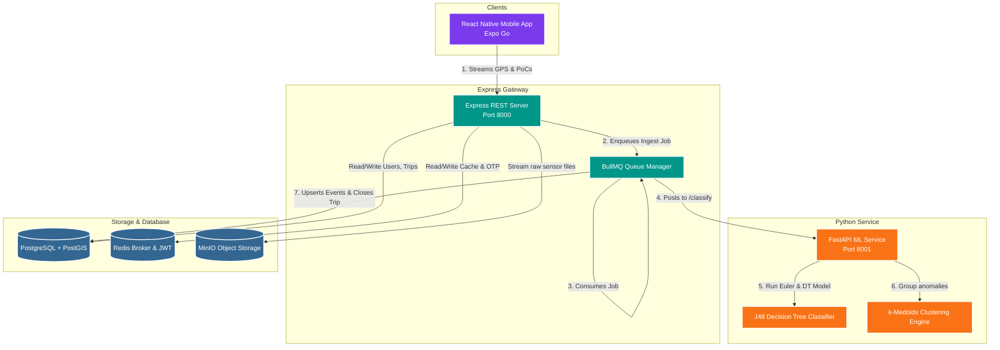

# 🗺️ RoadSense AI — Crowdsourced Road Intelligence Platform

[](https://opensource.org/licenses/MIT)
[](https://nodejs.org)
[](https://www.prisma.io)
[](https://fastapi.tiangolo.com)
[](https://reactnative.dev)
[](https://www.postgresql.org)
[](https://www.docker.com)

> **Scientific Foundation:** Built upon the research paper: *"Crowdsourcing from the True Crowd: Device, Vehicle, Road-Surface and Driving Independent Road Profiling from Smartphone Sensors"* — Alam et al., *Pervasive and Mobile Computing (2020)*.

RoadSense AI is a smartphone-powered crowdsourced road intelligence platform. It runs passively in the background of everyday commutes to detect, classify, and geo-locate **potholes**, **speed-breakers**, and **broken road patches** in real time—completely independent of vehicle class (2-wheeler, 3-wheeler, 4-wheeler), device model, placement (pocket, dashboard, handlebar), or individual driving styles. 

It generates a living, geo-tagged road quality map designed for commuters, logistics fleets, and civic engineers to prioritize repairs and navigate safely.

---

## 📖 Table of Contents
1. [Core Capabilities](#-core-capabilities)
2. [System Architecture](#%EF%B8%8F-system-architecture)
3. [Algorithmic & ML Core](#-algorithmic--ml-core)
4. [Tech Stack](#-tech-stack)
5. [Agent Skills & Automation](#-agent-skills--automation)
6. [Repository Structure](#-repository-structure)
7. [Getting Started & Installation](#-getting-started--installation)
   - [Infrastructure Setup (Docker Compose)](#1-infrastructure-setup-docker-compose)
   - [Express Backend Setup](#2-express-backend-setup)
   - [Python ML Microservice Setup](#3-python-ml-microservice-setup)
   - [Mobile Client Setup (React Native + Expo)](#4-mobile-client-setup-react-native-expo)
8. [API Cheat Sheet](#-api-cheat-sheet)
9. [Documentation Index](#-documentation-index)

---

## ✨ Core Capabilities

*   **📱 Passive Background Sensing:** Runs silently during commutes utilizing standard accelerometer and gyroscope components, capturing road vibrations without requiring active screen time or manual tagging.
*   **📐 Auto-Orientation Engine:** Normalizes three-axis coordinates into a standard vehicle reference frame using real-time Euler angle translations, mitigating device placement variance.
*   **⚡ Speed-Adaptive Dynamic Thresholds:** Evaluates road surface irregularities against thresholds that automatically adapt to vehicle speed, eliminating static threshold calibration errors.
*   **🤖 Server-Side ML Classification (J48 Decision Tree):** Evaluates candidate anomalies through a trained machine learning model utilizing context features (`Zt`, `Z_prev`, `Z_next`, speed, and time delta) to filter false positives and catalog event types.
*   **📍 Robust k-Medoids Clustering:** Geo-localizes events by clustering nearby detections across multiple distinct trips. Discards isolated anomalies and locks true coordinates once a consensus threshold ($\lceil N_T / 3 \rceil + 1$) is achieved.
*   **🔊 Real-Time Proximity Alerts:** Generates instant haptic pulses and full-screen warning panels to alert active drivers of oncoming anomalies.
*   **📊 Gamification & Leaderboard:** Ranks top-contributing users based on trip coverage, events detected, and distance traveled to encourage user engagement.

---

## 🏗️ System Architecture

RoadSense AI uses a robust **dual-service architecture** where a Node.js/Express API handles user auth, CRUD, and telemetry ingestion, and a secondary Python microservice handles computationally expensive ML classifications and spatial clustering.



---

## 🧮 Algorithmic & ML Core

The project implements the exact algorithms laid out in the **RoadSurP** scientific paper.

### 1. Auto-Orientation Formula
To translate raw accelerometer data ($a_x$, $a_y$, $a_z$) from the device's variable reference frame to the vehicle's frame ($a_{x\_v}$, $a_{y\_v}$, $a_{z\_v}$), Euler pitch ($\theta$) and roll ($\beta$) angles are calculated continuously:

$$\theta = \arctan2(a_y, a_z)$$

$$\beta = \arctan2(-a_x, \sqrt{a_y^2 + a_z^2})$$

Using these, the vertical component (the $Z$-axis of the vehicle frame, representing road surface displacement) is isolated:

$$a_{z\_v} = -a_x \sin(\beta) + a_y \cos(\beta) \sin(\theta) + a_z \cos(\beta) \cos(\theta)$$

### 2. Speed-Adaptive Thresholds
Static acceleration thresholds are inaccurate because high speed intensifies impact forces. RoadSense updates the vertical acceleration event threshold ($T_t$) dynamically based on average vehicle speed ($V$):

$$T_t = T_0 + (V - L) \times S \quad \text{if } V > B$$

$$T_t = T_0 \quad \text{otherwise}$$

*   **$T_0$**: Base acceleration threshold depending on vehicle class (e.g., $1.08g$ for speed-breakers in 4-wheelers; $0.714g$ for potholes in 2-wheelers).
*   **$B$**: Base speed point ($20.0 \text{ km/h}$).
*   **$L$**: Lower adaptation limit ($20.0 \text{ km/h}$).
*   **$S$**: Scaling factor ($0.3$ for speed-breakers; $-0.3$ for potholes, which require lower thresholds at higher speeds as gravity limits vertical falling speed).

### 3. ML Feature Extraction & Classification
Once a Point of Concern (PoC) passes the dynamic threshold, a $5$-dimensional feature vector is sent to the **J48 Decision Tree Classifier**:

$$\vec{x} = \begin{bmatrix} Z_t & Z_{\text{next}} & Z_{\text{prev}} & T_p & S_p \end{bmatrix}$$

*   **$Z_t$**: Maximum acceleration amplitude at the detection timestamp.
*   **$Z_{\text{next}}$ / $Z_{\text{prev}}$**: Local peak amplitudes in the vertical direction within a time window $\Delta$ immediately after/before the event.
*   **$T_p$**: Time elapsed since the immediate prior event (dense spikes point to *broken road patches*).
*   **$S_p$**: Exact GPS-recorded vehicle speed at detection time.

### 4. k-Medoids Spatial Clustering
To geo-localize events and prevent duplicate reporting, a k-medoids algorithm groups close coordinates together, choosing the actual median event as the center coordinate. Detections only lock as a `ConfirmedEvent` once a minimum threshold of $\lceil N_T / 3 \rceil + 1$ distinct rider trails agree on the spot.

---

## 🛠️ Tech Stack

| Layer | Technology |
|---|---|
| **Mobile Client** | Expo SDK 53, React Native, TypeScript, Zustand, TanStack Query |
| **Mobile Hardware** | `expo-sensors` (150Hz Accelerometer & Gyroscope), `expo-location` (GPS) |
| **Animations & UI** | `react-native-reanimated`, `expo-blur` (glassmorphism), `expo-linear-gradient` |
| **Express Gateway** | Node.js, Express, TypeScript, JWT Auths, `ioredis` |
| **Database & ORM** | PostgreSQL 16 with PostGIS extensions, Prisma ORM |
| **Worker Queue** | BullMQ backed by Redis |
| **ML Microservice** | Python 3.11, FastAPI, scikit-learn, numpy, pandas, Uvicorn |
| **Object Store** | MinIO S3 (storing high-frequency raw vibration logs) |

---

## 🤖 Agent Skills & Automation

This repository incorporates built-in automation and guidelines for AI Agents, structured via **Matt Pocock's Skills** framework. This ensures coding assistants contextually understand the codebase and architectural constraints out-of-the-box.

*   **`.agents/skills/`**: Contains active workflows and system prompts.
    *   `setup-matt-pocock-skills`: Bootstraps domain rules, project-level triage labels, and issue tracker synchronization.
    *   `design-system`: Enforces the premium, light-mode, and glassmorphic UI/UX standards specifically for the `mobile` React Native app.
*   **`.openclaude/`**: Stores localized AI configuration to persist context for coding sessions.

---

## 📁 Repository Structure

```
RE Project/
├── backend/
│   ├── prisma/
│   │   ├── schema.prisma          # 8 models (User, Trip, RoadEvent, ConfirmedEvent, etc.)
│   │   └── migrations/            # PostGIS schema migrations
│   ├── ml/                        # Python Machine Learning Microservice
│   │   ├── service.py             # FastAPI entrypoint (port 8001)
│   │   ├── classifier.py          # J48 Decision Tree pipeline + patch detection
│   │   ├── clustering.py          # k-Medoids grouping & silhouette analysis
│   │   ├── orientation.py         # Euler rotation math
│   │   ├── threshold.py           # Speed-adaptive calibrations
│   │   ├── train.py               # Model training script
│   │   └── requirements.txt       
│   └── src/                       # Node.js API Service
│       ├── index.ts               # Express entrypoint (port 8000)
│       ├── config.ts              # System configuration singleton
│       ├── db.ts                  # Shared Prisma client
│       ├── redis.ts               # Shared ioredis connector
│       ├── lib/jwt.ts             # JWT Token handling
│       ├── middleware/auth.ts     # requireAuth middleware
│       ├── routes/                
│       │   ├── auth.ts            # Registrations & OTP verifications
│       │   ├── trips.ts           # Ingestion endpoints & POC payloads
│       │   ├── events.ts          # Geoqueries, manual reports & RQI scores
│       │   ├── users.ts           # User stats & profile ranks
│       │   └── leaderboard.ts     # User contribution rankings
│       └── services/
│           └── queue.ts           # BullMQ ingestion worker & ML dispatcher
│
├── mobile/                        # React Native Mobile App
│   ├── app/                       # Expo Router Views
│   │   ├── onboarding/            # Selection of vehicle & phone placement
│   │   ├── auth/                  # Phone & OTP verifications
│   │   ├── (tabs)/                # Main Navigation (Map, Report, Trips, Profile)
│   │   └── trip/                  # Active Trip tracker screen
│   ├── components/                
│   │   ├── ui/                    # Sleek premium Glassmorphic buttons & cards
│   │   ├── map/                   # Markers, Bottom sheets, Quality Badges
│   │   └── alert/                 # Full-screen Proximity overlay alarms
│   ├── services/                  
│   │   ├── api.ts                 # Axios API connector with JWT auto-refresh
│   │   ├── SensorEngine.ts        # 150Hz physics telemetry engine
│   │   └── cache.ts               # AsyncStorage client-side cache
│   ├── store/                     # Zustand state hooks
│   └── constants/                 # UI system tokens (colors, gradients, typography)
│
├── .agents/                       # AI Agent Skills (Matt Pocock Skills) & Workflows
├── .openclaude/                   # Claude AI localized context settings
├── Docs/                          # Scientific & Technical specs
└── docker-compose.yml             # PostgreSQL/PostGIS, Redis, MinIO
```

---

## 🚀 Getting Started & Installation

### Prerequisites
Make sure you have:
*   [Docker & Docker Compose](https://www.docker.com/products/docker-desktop)
*   [Node.js v20+](https://nodejs.org)
*   [Python 3.11+](https://www.python.org/downloads/)
*   [Expo Go app](https://expo.dev/expo-go) on your physical Android/iOS test device

---

### 1. Infrastructure Setup (Docker Compose)
Launch the databases, queuing brokers, and object stores:
```bash
# Spin up PostgreSQL/PostGIS, Redis, and MinIO S3
docker compose up -d
```

---

### 2. Express Backend Setup
Create your env variables:
```bash
cd backend
cp .env.example .env
# Ensure DATABASE_URL, REDIS_URL, and MINIO credentials match your local docker setup
```

Install packages, run DB migrations, and launch the Express Server:
```bash
npm install
npx prisma migrate dev
npm run dev
```
The Express Gateway will run on `http://localhost:8000`.

---

### 3. Python ML Microservice Setup
Navigate to the ML directory and prepare the Python environment:
```bash
cd backend/ml
python -m venv venv
source venv/bin/activate   # On Windows use: venv\Scripts\activate
pip install -r requirements.txt
```

Launch the ML FastAPI service:
```bash
python -m uvicorn service:app --port 8001
```
The ML Service will run on `http://localhost:8001`.

---

### 4. Mobile Client Setup (React Native + Expo)
Configure the local network API URL:
```bash
cd mobile
cp .env.example .env
# Set EXPO_PUBLIC_API_URL to your computer's local Wi-Fi IP address (e.g., http://192.168.1.100:8000/api/v1)
```

Install packages and boot the Metro server:
```bash
npm install
npx expo start
```
*   Scan the generated QR code in your terminal using the **Expo Go** application (Android) or the native Camera app (iOS).
*   *Note: Ensure your phone and computer are on the exact same Wi-Fi network.*

---

## ⚡ API Cheat Sheet

All routes must be prefixed with `/api/v1`. Bearer JWT tokens are required for authenticated routes.

| Method | Endpoint | Description | Auth Required |
| :--- | :--- | :--- | :--- |
| **POST** | `/auth/register` | Register or update user role/vehicle | No |
| **POST** | `/auth/send-otp` | Trigger verification SMS code | No |
| **POST** | `/auth/login` | Verify OTP code and return access & refresh JWTs | No |
| **POST** | `/auth/refresh` | Re-generate expired access token via refresh token | No |
| **POST** | `/trips` | Initialize a trip and return trip ID | Yes |
| **PATCH** | `/trips/:id/end` | Finish trip; enqueues processing job | Yes |
| **POST** | `/trips/:id/poc` | Batch upload detected candidate vibration coordinates | Yes |
| **GET** | `/events` | Get confirmed anomalies within a coordinate radius | Yes |
| **GET** | `/events/bbox` | Get confirmed anomalies within bounding box | Yes |
| **POST** | `/events/report` | Manually tag a road anomaly | Yes |
| **GET** | `/events/quality` | Fetch Road Quality Index (RQI) score (0-100) | Yes |
| **GET** | `/users/me/stats` | Retrieve user total trips, distance and rank | Yes |
| **GET** | `/leaderboard` | View top contributors across the platform | No |
| **GET** | `/health` | Check core server status | No |

---

## 🗂️ Documentation Index

To explore the mathematical, spatial, and layout details of RoadSense AI, review the Docs suite:
*   [Product Requirements Document (PRD)](Docs/PRD.md) - Deep dive into target users, success metrics, product vision, and functional scopes.
*   [Technical Requirements Document (TRD)](Docs/TRD.md) - System specifications, PostGIS structures, API specifications, and worker pipeline configurations.
*   [UI/UX Design Specifications](Docs/UIUX.md) - Color system tokens, layout structures, and accessibility standards.
*   [AI Development Manual](Docs/AI_INSTRUCTIONS.md) - Rules for coding, algorithm constants, signal low-pass parameters, and test checklists.

---
*Created by **Soumya Chakraborty** (`soumyachk101`) .*
